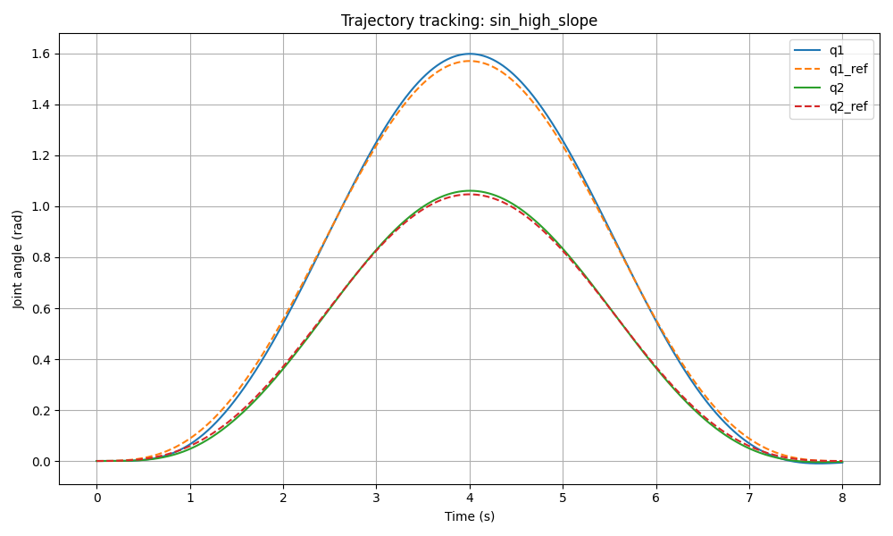
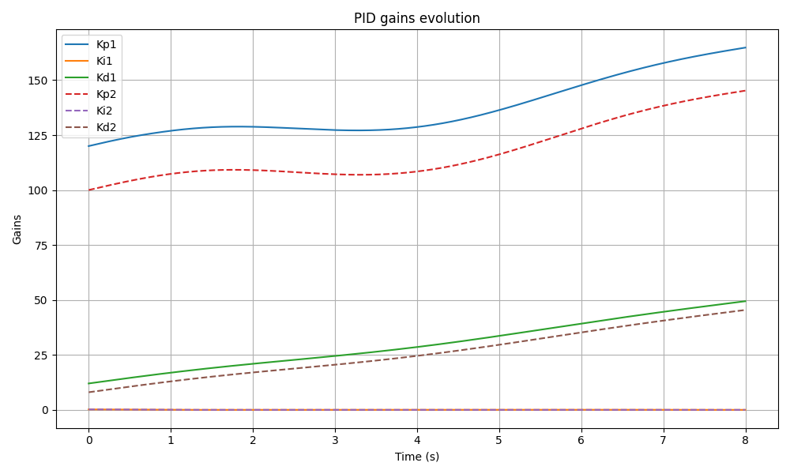
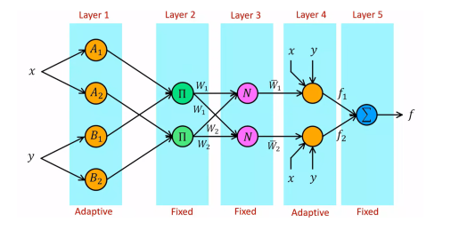

# ANFIS-Based Joint State Control of a 2-DoF Manipulator

This repository contains the implementation of an **Adaptive Neuro-Fuzzy Inference System (ANFIS)** for joint-state control of a **2-DoF robotic manipulator**.  
The controller is designed to learn nonlinear joint torque-angle relationships and provide smooth, robust tracking performance compared to classical PID-based approaches.

---

## 📌 Project Overview

The dynamics of robotic manipulators are highly nonlinear, especially under disturbances, unmodeled dynamics, or changing loads.  
Traditional controllers such as PD/PID may struggle in these regimes.

This project explores the use of an **ANFIS controller**, which combines:
- Neural network learning  
- Fuzzy inference systems  
- Nonlinear function approximation  

to achieve **adaptive, accurate, and robust joint control**.

---

## 🧠 System Architecture

The ANFIS controller predicts required joint torques from joint states (angles, velocities) and desired trajectories.

Key features include:
- Hybrid learning (gradient + least squares)
- Fuzzy membership tuning
- Online generalization capability
- Nonlinear control performance superior to PID

---

